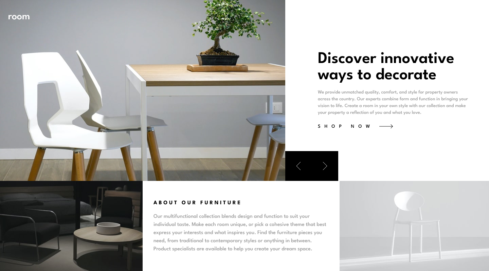

# RoomLandingPage

This is a solution to the [Room homepage challenge on Frontend Mentor](https://www.frontendmentor.io/challenges/room-homepage-BtdBY_ENq). Frontend Mentor challenges help you improve your coding skills by building realistic projects. 

## Table of contents

- [Overview](#overview)
  - [The challenge](#the-challenge)
  - [Screenshot](#screenshot)
  - [Links](#links)
- [My process](#my-process)
  - [Built with](#built-with)
  - [What I learned](#what-i-learned)
  - [Continued development](#continued-development)
  - [Useful resources](#useful-resources)
- [Author](#author)


## Overview

### The challenge

Users should be able to:

- View the optimal layout for the site depending on their device's screen size
- See hover states for all interactive elements on the page
- Navigate the slider using either their mouse/trackpad or keyboard

### Screenshot




### Links
- Solution URL: [Add solution URL here](https://your-solution-url.com)

## My process

### Built with

- Semantic HTML5 markup
- Mobile-first workflow
- [Tailwind CSS](https://tailwindcss.com/)
- [TypeScript]https://www.typescriptlang.org/)
- [Next.js](https://nextjs.org/) - React framework

### What I learned

- Positioning Elements via Relative and Absolute Positioning

- Using calc to position certain elements exactly

```jsx
<nav id = 'nav' className='absolute w-[calc(50%+32px)] (For Mobile Screen) flex flow-row items-center justify-between py-8 pl-6 md:justify-start'>
    </img>
    <h1 id = 'weblogo' className='font-spartan text-3xl text-White md:mr-16'>room</h1>
    <ul id = 'links' className='hidden font-spartan text-md text-White md:flex flex-row flex-nowrap space-x-8 '>
    </ul>
</nav>
```

- Getting an Element and SVG to be on the same line

```html
    <a href='#' className='inline-block space-x-4 hover:text-DarkGray' onMouseOver={changeSVGToGray} onMouseLeave={changeSVGToBlack}>
        <span className='peer text-sm font-spartan tracking-[.75rem]'>SHOP NOW</span>
        <svg width="40" height="12" xmlns="http://www.w3.org/2000/svg"><path id = 'arrow' d="M34.05 0l5.481 5.527h.008v.008L40 6l-.461.465v.063l-.062-.001L34.049 12l-.662-.668 4.765-4.805H0v-1h38.206l-4.82-4.86L34.05 0z" fill="#000" fill-rule="nonzero"/></svg>
    </a>
```

## Author

- Website - [Bakhtiar Reza](https://bakhtiar-reza-site.vercel.app/)
- Frontend Mentor - [@Dradeon](https://www.frontendmentor.io/profile/Dradeon)

### Continued development

This is my first project using TypeScript and I'm looking forward to doing more project using this language as it would be beneficial for my projects in the future. Also I'm starting to feel more comfortable with Tailwind CSS and I personally like it more than having to write my styles in SASS files.

### Useful resources

- [Typescript Doc](https://www.typescriptlang.org/) - This helped me under what I would need to look out for when implementing some of the logic in my code such as null chekcing.
- [Tailwind Doc](https://tailwindcss.com/) - This helped me learn which classes I needed to use when styling some of my components. 